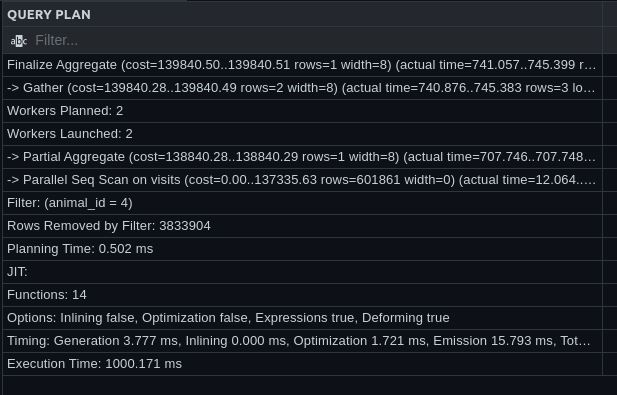
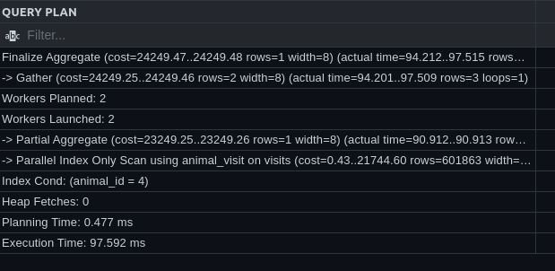
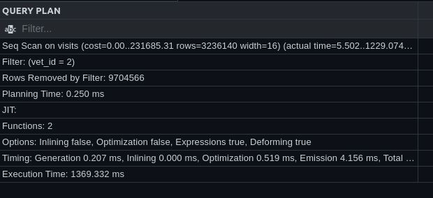
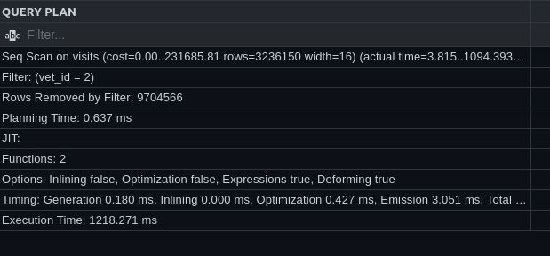
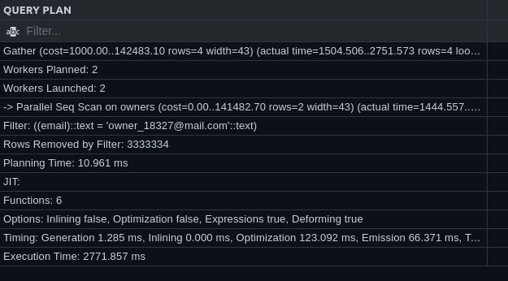
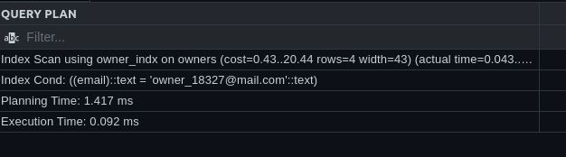
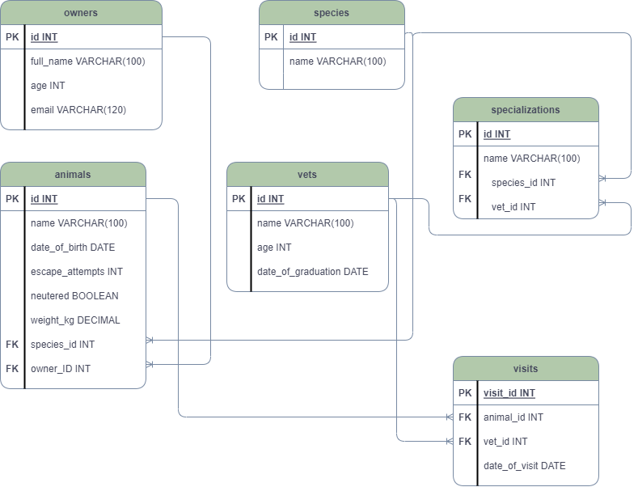

# Yuriy Chamkoriyski Vet clinic database project

> Postgre SQL exercise

## Description

In this project you will use a relational database to create the initial data structure for a vet clinic. You will create a table to store animals' information, insert some data into it, and query it.

## Requirements:

### Phase 1, create animals table
Please, see all the requirements [here](https://github.com/microverseinc/curriculum-databases/blob/main/db-structure/vet_clinic_create_tables.md)

### Phase 2, query and update animals table
Please, see all the requirements [here](https://github.com/microverseinc/curriculum-databases/blob/main/db-structure/vet_clinic_query_update_tables.md)

### Phase 3, query multiple tables
Please, see all the requirements [here](https://github.com/microverseinc/curriculum-databases/blob/main/db-structure/vet_clinic_query_multiple_tables.md)

### Phase 4, add "join table" for visits
Please, see all the requirements [here](https://github.com/microverseinc/curriculum-databases/blob/main/db-structure/vet_clinic_join_table.md)

### Phase 5, database performance audit pair programming
Please, see all the requirements [here](https://github.com/microverseinc/curriculum-databases/blob/main/db-structure/vet_clinic_performance_audit.md)

Query one before the optimization: 

 Query one after the optimization: 

Query two before the optimization: 

 Query two after the optimization: 

Query three before the optimization: 

 Query three after the optimization: 

### Phase 6, add database schema diagram
Please, see all the requirements [here](https://github.com/microverseinc/curriculum-databases/blob/main/db-structure/vet_clinic_diagram.md)

### Phase 7, schema based on diagram
Please, see all the requirements [here](https://github.com/microverseinc/curriculum-databases/blob/main/db-structure/database_from_diagram.md)

[Diagram](https://github.com/microverseinc/curriculum-databases/blob/main/db-structure/images/clinic_diagram.png)

## Built With

- Major languages: PostgreSQL
- Frameworks: 
- Technologies used: 
- Tested with: 

## Live Demo

N/A

### Prerequisites

N/A

### Setup

N/A

### Usage

N/A

### Deployment

N/A

## Authors

👤 **Yuriy Chamkoriyski**

- GitHub: [@Hombre2014](https://github.com/Hombre2014)
- Twitter: [@Chamkoriyski](https://twitter.com/Chamkoriyski)
- LinkedIn: [axebit](https://linkedin.com/in/axebit)

From phase 5 onwards:

👤 **Victoir Barh**

- GitHub: [@vic778](https://github.com/vic778)
- Twitter: [@VictoirBarh](https://twitter.com/VictoirBarh)
- LinkedIn: [Victoir barherenduba](https://www.linkedin.com/in/victor-emmanuel-barh-a93900200/)

## 🤝 Contributing

Contributions, issues, and feature requests are welcome!

Feel free to check the [issues page](https://github.com/Hombre2014/vet_clinic/issues).

## Show your support

Give a ⭐️ if you like this project!

## Acknowledgments

## 📝 License

This project is [MIT](./license.md) licensed.